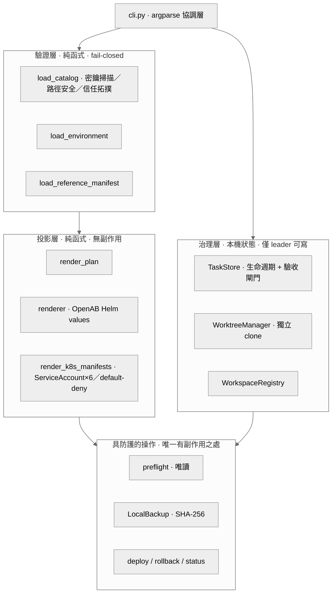
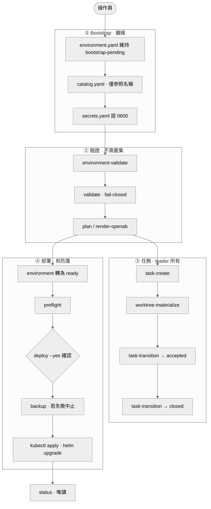

# oab-agents-control

OpenAB 多 Agent 架構的 **Local-first Control CLI**。

它驗證嚴格的 catalog、建立彼此獨立的 Git checkout、產生上游 OpenAB values、
保存由 leader 管理的任務紀錄，並產生具防護機制的部署計畫。
離線操作不依賴正在運作的 K3s 叢集、Discord、GitLab 或外部控制平面。

---

## 專案用途

### 背景場景

要在自己的機器或私有 K3s 上，跑一組互相協作的 AI coding agent（基於上游
**OpenAB** 專案），典型編制是四個角色：

| 角色 | 職責 |
| --- | --- |
| `leader` | 協調、派工、唯一能寫入任務紀錄的身分 |
| `researcher` | 研究與資料蒐集 |
| `developer` | 程式開發與交付 |
| `reviewer` | 獨立審查 |

它們透過 Discord 溝通、以 GitLab MR 交付、跑在 Kubernetes Pod 裡。

**本 repository 不是 agent 本身**，而是負責「安全地把這套編制部署與治理起來」
的控制工具：把一組 AI agent 當成**有嚴格權限邊界的團隊成員**來管理，
並把所有危險操作關在「驗證 → 計畫 → 備份 → 人類確認」的閘門後面。

### 核心職責

| 功能 | 說明 |
| --- | --- |
| **Catalog 驗證** | 以版本化、不含任何密鑰的 YAML 宣告所有 agent；fail-closed 檢查信任拓撲、路徑越界與憑證外洩 |
| **產生部署產物** | 投影成 OpenAB Helm values 與 Kubernetes 隔離資源（SA、RBAC、default-deny NetworkPolicy） |
| **獨立 worktree** | 為每個 agent 對每個授權 repository 做完整 `git clone`，彼此隔離，不掛載 source collection |
| **任務治理** | leader 專屬的持久任務紀錄、明確生命週期、程式任務驗收閘門 |
| **具防護的部署** | `deploy` 預設只輸出 plan；確認套用需先完成外部加密備份 |
| **權限分界** | 部署與寫入 Secret 使用兩份不同、各自 namespace-scoped 的 kubeconfig |

### 設計主張

- **Local-first／離線可用** — 不需 K3s、Discord、GitLab 即可完整驗證與預覽
- **密鑰零進版控** — catalog、環境合約、任務紀錄、備份中只能出現「名稱參照」
- **Catalog 為唯一授權來源** — 任務紀錄不得成為第二個授權來源，每次 `status` 重新比對
- **明確邊界** — repository 自己聲明「這不代表環境已可部署」

設計理由與取捨請見 **[docs/架構說明.md](docs/架構說明.md)**。

---

## 架構

### 模組分層



### 端到端流程



---

## 快速開始

```bash
PYTHONPATH=. python3 -m unittest discover -s tests -v          # 90 項測試
PYTHONPATH=. python3 -m oab_control.cli validate \
  examples/catalog.example.yaml --no-path-check \
  --secrets-file config/reference-manifest.example.yaml --json
```

安裝步驟、Windows PowerShell 語法差異與更多離線驗證指令，
請見 **[docs/安裝與快速開始.md](docs/安裝與快速開始.md)**。

---

## 文件導覽

| 文件 | 內容 | 何時閱讀 |
| --- | --- | --- |
| [docs/架構說明.md](docs/架構說明.md) | 分層設計、安全邊界與取捨理由 | 想理解「為什麼這樣設計」 |
| [docs/安裝與快速開始.md](docs/安裝與快速開始.md) | Python 安裝、測試、離線驗證指令 | 第一次使用 |
| [docs/本機部署實作.md](docs/本機部署實作.md) | 本機真實配置與可直接執行的部署步驟 | **要在這台機器上部署** |
| [docs/操作手冊.md](docs/操作手冊.md) | bootstrap → 任務 → 部署 → 復原的完整流程 | 實際操作時 |
| [docs/部署前置資料清單.md](docs/部署前置資料清單.md) | 啟用真實環境前需提供的資料與權限分界 | 準備上線前 |
| [docs/git-遠端與憑證配置手冊.md](docs/git-遠端與憑證配置手冊.md) | SSH／PAT 設定與 GitHub 推送 | 設定版控時 |
| [docs/參考/catalog-契約.md](docs/參考/catalog-契約.md) | Catalog 欄位契約與驗證規則逐條說明 | 撰寫或除錯 catalog |
| [docs/參考/完整度檢查.html](docs/參考/完整度檢查.html) | 2026-09-04 的完整度稽核報告 | 了解目前實作狀態 |

完整索引見 **[docs/README.md](docs/README.md)**。

---

## 目前邊界

此 repository 中的控制切片**不宣稱環境已可部署**。實際操作員仍須提供並驗證：

| 項目 | 追蹤編號 |
| --- | --- |
| K3s 安裝與 Secret-at-rest 加密 | A001 |
| namespace-scoped deployer RBAC | A003 |
| local egress proxy 與 domain policy | A005 |
| Discord 資源權限與 dispatch adapter | A007 |
| GitLab MR 與 CI evidence adapter | A009 |
| 外部加密備份／還原演練 | A011、A012 |
| 單一低風險的 end-to-end tracer bullet | A013、A014 |

上述工作在設計 repository 中追蹤，不在本 repository 的範圍內。
