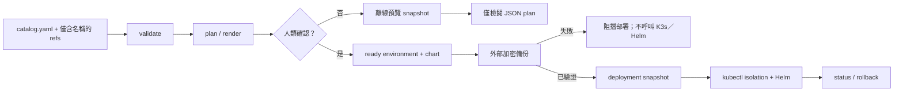

# 本機操作員 Runbook

此 repository 是 OpenAB 單一 leader 拓撲的 local-first control 切片。在最後的
`deploy --yes` gate 前，即使沒有 Discord、GitLab 或正在運作的 K3s cluster，
也可安全地操作與驗證。



## Bootstrap

1. 在路徑、GitLab project、Discord ID、runtime pin、proxy、備份與核准者尚未
   確定時，請讓 `config/environment.yaml` 維持 `bootstrap-pending`。不可用猜測
   的值取代 placeholder。
2. 在環境的 `paths.catalog` 建立版本化 catalog，且其中只保留 Secret／identity
   reference。除非操作員刻意記錄 repository-specific base branch，否則使用
   `origin/develop`。
3. 在 `k3s` contract 填入真實 context、deployer kubeconfig 的環境變數、
   Secrets-at-rest recovery reference 與 `network_policy_controller: kube-router`；
   在操作員驗證這些值前，合約應維持 pending。
4. 在 Git 中保存僅含名稱的 reference manifest。實際值應放在已忽略版本控制、
   且只有檔案擁有者可存取的檔案中：

   ```bash
   chmod 600 config/secrets.yaml
   ```

5. 執行離線檢查：

   ```bash
   PYTHONPATH=. python3 -m oab_control.cli environment-validate config/environment.yaml --json
   PYTHONPATH=. python3 -m oab_control.cli validate config/catalog.yaml \
     --secrets-file config/reference-manifest.example.yaml --json
   PYTHONPATH=. python3 -m oab_control.cli plan config/catalog.yaml \
     --secrets-file config/reference-manifest.example.yaml > /tmp/oab-plan.json
   ```

在所有 `pending_decisions` 項目解決，且操作員將 `status` 改為 `ready` 前，
`environment-validate --require-ready` 必須持續失敗。

## 部署前唯讀檢查

完成 ready contract 與本機 kubeconfig 設定後、任何 `deploy --yes` 之前，先執行：

```bash
PYTHONPATH=. python3 -m oab_control.cli preflight config/environment.yaml \
  --chart /path/to/openab/charts/openab --json
```

只有輸出中的 `ready` 為 `true` 才繼續部署。此檢查不會呼叫 Kubernetes API、不會
執行 Helm，也不會輸出 kubeconfig 路徑或內容；它只確認 `git`、`helm`、`kubectl`
是否在 PATH、chart 是否有 `Chart.yaml`，以及 deployer／Secret materializer 的
環境變數是否各自指向不同且存在的檔案。

## Task 與 worktree 生命週期

在 materialize checkout 前，leader 必須建立 task record，並將狀態轉為
`assigned`／`active`。remote map 只包含精確的本機 repo 路徑與其 GitLab delivery
remote；其中不含 token。

第一期全域最多兩項未結束任務，同一 Agent 最多一項。`planned` 與已驗收但仍待 merge
的 `accepted` task 都會佔用容量，因此不要先大量建立尚未派送的 task record；完成或
明確取消後才釋放名額。

`task-create` 必須同時接收 catalog。CLI 會將 task 的 Agent、repository、
checkout、worktree、container mount、base branch、GitLab identity 與 private
reply channel 全部與 catalog 的單一 grant 比對；程式任務另外要求 `developer`
角色與 `write` grant。可從範例複製後，先以人類已明確授權的值填入
commit／push／MR authorization：

```bash
PYTHONPATH=. python3 -m oab_control.cli task-create examples/task.example.json \
  --catalog config/catalog.yaml \
  --secrets-file config/reference-manifest.yaml \
  --tasks-dir .oab-control/tasks --json
```

```bash
PYTHONPATH=. python3 -m oab_control.cli worktree-materialize \
  config/catalog.yaml developer task-001 \
  --remotes-file config/remotes.json \
  --registry-json .oab-control/workspace-registry.json --json
```

manager 會執行獨立的 `git clone --no-hardlinks`、fetch 設定的
`origin/<base>` branch，並建立 task branch。它絕不 mount collection root，
也不使用 linked worktree。`read` grant 一律 render 為唯讀 mount。

只有 leader 可以變更 task record。程式驗收需要測試、獨立 review、
`ci_status=success`、leader summary、與任務的確切 owner／repository／branch
相符的 commit／push／MR 證據，以及帶有 actor／time／scope 證據的 boolean human
merge approval。若工作被放棄，應保存 cancellation reason 與 decider 後再關閉任務，
不得繞過此 gate。程式任務的 MR 實際 merge 後，leader 還必須在
`accepted → closed` transition 提供 `merge_completed: true`、MR、merge actor、
具時區的 merge timestamp，以及等於 task `base_branch` 的 merge target；CLI 會將
此交付證據寫入 `delivery.md`。研究／文件任務在 accepted 後不需要 MR merge 證據。
程式任務被驗收時，commit SHA、push ref、MR reference 與成功 CI status 也會寫入
結構化的 `task.json`，使 `task-list` 與 `status --json` 能在 merge 前顯示正式交付。
程式任務若取消（包含已驗收但未 merge 的情況），則必須保存 cancellation reason 與
decider，控制面會寫入取消時間；cleanup 僅接受已保存 merge completion 或
cancellation evidence 的 closed code task。

每次透過 `status --tasks-dir .oab-control/tasks` 檢查時，control plane 都會重新把
task envelope 與當前 catalog 的精確 grant、worktree、base branch、GitLab identity
與 private reply channel 比對。若 catalog 已變更，觀測結果會出現
`catalog_binding: mismatch`；尚在執行的任務會標為 `needs-reconciliation`。此為唯讀
告警，不會悄悄修改 task record 或代替 leader 做派工決策。

驗收完成且 task 狀態為 `closed` 後，才可明確執行 cleanup：

```bash
PYTHONPATH=. python3 -m oab_control.cli worktree-cleanup \
  config/catalog.yaml developer task-001 \
  --remotes-file config/remotes.json \
  --tasks-dir .oab-control/tasks \
  --registry-json .oab-control/workspace-registry.json --yes --json
```

cleanup 會拒絕存在 tracked changes 的 worktree，只移除 untracked file 與 task
branch，並保留 agent worktree。retirement 是獨立操作，需要 catalog 管理的路徑、
manager 的 ownership marker、registry row 與 `--yes`：

```bash
PYTHONPATH=. python3 -m oab_control.cli worktree-retire \
  --catalog config/catalog.yaml developer /srv/oab-agent-worktrees/developer \
  --registry-json .oab-control/workspace-registry.json --yes --json
```

## 部署與復原

第一次 deploy 前，請先備份至外部加密磁碟／NAS。來源與目的地 map 為 JSON path
manifest（不包含憑證）：

```bash
PYTHONPATH=. python3 -m oab_control.cli backup config/backup-sources.json \
  --output /mnt/encrypted/oab-backups \
  --attestation "operator verified encrypted NAS mount" --yes --json
```

backup manifest 會驗證 checksum，並排除 `secrets.yaml`、`.env` 與相關本機 value
file。restore 刻意只允許還原到不存在且乾淨的目的地，且絕不會隱式執行：

```bash
PYTHONPATH=. python3 -m oab_control.cli restore \
  /mnt/encrypted/oab-backups/backup-... config/restore-destinations.json \
  --yes --json
```

不帶 `--yes` 的 `deploy` 會建立不含 Secret 的預覽 snapshot，不會變更 Kubernetes。
確認執行時，必須先成功完成外部備份才會建立 deployment snapshot，並額外需要
包含 `Chart.yaml` 的 OpenAB chart：

```bash
PYTHONPATH=. python3 -m oab_control.cli deploy config/catalog.yaml \
  --environment config/environment.yaml \
  --chart /path/to/openab/charts/openab \
  --secrets-file config/secrets.yaml \
  --backup-sources config/backup-sources.json \
  --backup-output /mnt/encrypted/oab-backups \
  --backup-attestation "operator verified encrypted NAS mount" \
  --snapshot-dir /path/to/external/backup/snapshots --yes --json
```

確認部署時，三個 `--backup-*` 參數皆為必要。control operation 必須在建立
deployment snapshot 或呼叫 Kubernetes／Helm 前，先建立並驗證外部備份；備份失敗
會阻擋部署。確認套用前，將環境合約指定的 `deployer_kubeconfig_env`（通常為
`KUBECONFIG`）指向 namespace-scoped 的 `oab-control-deployer` credential
（不是 K3s admin config）；Namespace 建立與初始 RBAC bootstrap 必須由具有
cluster-bootstrap 權限的操作員執行一次。ready contract 與真實 K3s context
都是操作員責任。產生的 isolation manifest 會
bootstrap namespace、四個 agent account、獨立的 deployer／Secret-writer account、
每個 agent 的空 Roles／Bindings 與 default-deny policy。請使用
bootstrap／deployer identity 套用（絕不可使用 agent account）；Helm 本身不再要求
cluster-wide Namespace creation。失敗會記錄於 snapshot metadata，且絕不輸出
Secret 值。`status` 為唯讀，會回報本機 registry／task／worktree observation；
無法連上 K3s API 時，runtime 會回報 `unknown`。
若提供本機 `config/secrets.yaml`，則需另外設定與 deployer 不同的
`secret_materializer_kubeconfig_env`；Secret 套用只使用此憑證，Kubernetes
isolation 與 Helm 仍只使用 deployer 憑證。
若要以 ready contract 指定的 deployer kubeconfig 查詢 runtime，可使用：

```bash
PYTHONPATH=. python3 -m oab_control.cli status config/catalog.yaml \
  --environment config/environment.yaml --json
```

rollback 會先預覽選取的 snapshot，並需要相同的 ready environment、chart 與明確
確認。它會在取代目前 catalog 前套用 desired K8s state，且絕不變更 Git branch 或
merge request。

## 目前邊界

已提交的 control 切片不宣稱環境已具備 deploy-ready 條件。實際操作員仍必須提供
並驗證 K3s 安裝與 Secrets-at-rest encryption、namespace-scoped deployer RBAC、
local egress proxy 與 domain policy、Discord 資源權限／dispatch adapter、GitLab
MR 與 CI evidence adapter、外部加密 backup／restore 演練，以及單一低風險的
end-to-end tracer bullet。這些工作在設計 repository 中以 A001、A003、A005、
A007、A009、A011、A012、A013 與 A014 追蹤。
