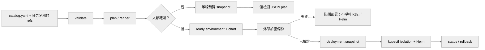

# 操作手冊

本文是實際操作的**單一來源**：bootstrap、任務生命週期、部署與復原的每個閘門
都在這裡完整說明一次。

設計理由請見 [架構說明.md](架構說明.md)；
catalog 欄位規則請見 [參考/catalog-契約.md](參考/catalog-契約.md)。

在最後的 `deploy --yes` 閘門之前，即使沒有 Discord、GitLab 或運作中的 K3s，
以下所有步驟都可以安全地執行與驗證。



> 以下一律使用 Bash 語法。PowerShell 請先設定 `$env:PYTHONPATH = "."`
> 並移除行首的 `PYTHONPATH=.`（見 [安裝與快速開始.md](安裝與快速開始.md)）。

---

## Bootstrap

### 0. 從範本建立你自己的設定

`config/` 底下只有 `*.example` 範本進版控。實際設定含你的路徑與 Discord ID，
屬於操作員專屬資料，已被 `.gitignore` 排除：

```bash
cp config/catalog.example.yaml            config/catalog.yaml
cp config/environment.example.yaml        config/environment.yaml
cp config/reference-manifest.example.yaml config/reference-manifest.yaml
cp config/secrets.yaml.example            config/secrets.yaml && chmod 600 config/secrets.yaml
cp examples/remotes.example.json          config/remotes.json
cp examples/backup-sources.example.json   config/backup-sources.json
```

以下步驟都在編輯這些**你自己的**檔案。

### 1. 保持環境合約為 pending

在路徑、GitLab project、Discord ID、runtime pin、proxy、備份與核准者都還沒確定前，
讓 `config/environment.yaml` 維持 `bootstrap-pending`。**不可用猜測的值取代 placeholder。**

### 2. 建立 catalog

在環境合約的 `paths.catalog` 位置建立版本化 catalog，其中只保留 Secret 與 identity
**參照名稱**。除非刻意記錄 repository 專屬的 base branch，否則使用 `origin/develop`。

欄位規則見 [參考/catalog-契約.md](參考/catalog-契約.md)。

### 3. 填寫 K3s 合約

在 `k3s` 區段填入真實 context、兩個 kubeconfig 環境變數名稱、
Secrets-at-rest recovery reference 與 `network_policy_controller: kube-router`。
在操作員驗證這些值之前，合約應維持 pending。

權限如何分界見
[部署前置資料清單.md](部署前置資料清單.md#k3s-bootstrap-的權限分界)。

### 4. 分離參照與實際值

僅含名稱的 reference manifest 進版控；實際值放在忽略版控、只有檔案擁有者可讀的檔案：

```bash
chmod 600 config/secrets.yaml
```

### 5. 執行離線檢查

```bash
PYTHONPATH=. python3 -m oab_control.cli environment-validate config/environment.yaml --json
PYTHONPATH=. python3 -m oab_control.cli validate config/catalog.yaml \
  --secrets-file config/reference-manifest.yaml --json
PYTHONPATH=. python3 -m oab_control.cli plan config/catalog.yaml \
  --secrets-file config/reference-manifest.yaml > /tmp/oab-plan.json
```

在所有 `pending_decisions` 解決、且操作員手動將 `status` 改為 `ready` 之前，
`environment-validate --require-ready` **必須持續失敗**。

---

## 部署前唯讀檢查

完成 ready contract 與本機 kubeconfig 設定後、任何 `deploy --yes` 之前，先執行：

```bash
PYTHONPATH=. python3 -m oab_control.cli preflight config/environment.yaml \
  --chart /path/to/openab/charts/openab --json
```

只有輸出中的 `"ready": true` 才繼續部署。

preflight 會檢查：

| 項目 | 內容 |
| --- | --- |
| 合約 | environment 是否通過 `--require-ready` |
| 工具 | `git`、`helm`、`kubectl` 是否在 PATH |
| Chart | 指定目錄是否存在且含 `Chart.yaml` |
| 憑證 | 兩個 kubeconfig 環境變數是否各自指向**不同且存在**的檔案 |

preflight **不會**連線 Kubernetes、不執行 Helm、不讀取 kubeconfig 內容，
也不輸出 kubeconfig 的路徑。

---

## 任務與 worktree 生命週期

### 併發上限

第一期全域最多**兩項未結束任務**，同一 agent 最多一項。
`planned`、`assigned`、`active`、`review`、`accepted`、`needs-reconciliation`
都佔用名額，因此不要預先大量建立尚未派送的任務紀錄；完成或明確取消後才釋放。

理由見 [架構說明.md](架構說明.md#為什麼第一期只允許兩項未結束任務)。

### 1. 建立任務紀錄

`task-create` 必須同時接收 catalog。CLI 會將任務的 agent、repository、checkout、
worktree、container mount、base branch、GitLab identity 與 private reply channel
全部與 catalog 的**單一 grant** 比對；程式任務另外要求 `developer` 角色與 `write` grant。

```bash
PYTHONPATH=. python3 -m oab_control.cli task-create examples/task.example.json \
  --catalog config/catalog.yaml \
  --secrets-file config/reference-manifest.yaml \
  --tasks-dir .oab-control/tasks --json
```

可從 `examples/task.example.json` 複製後修改，並以人類已明確授權的值填入
`commit_authorized`／`push_authorized`／`mr_authorized`。

### 2. 轉為 assigned／active，建立 checkout

```bash
PYTHONPATH=. python3 -m oab_control.cli task-transition task-001 assigned --json

PYTHONPATH=. python3 -m oab_control.cli worktree-materialize \
  config/catalog.yaml developer task-001 \
  --remotes-file config/remotes.json \
  --registry-json .oab-control/workspace-registry.json --json
```

remote map 只包含精確的本機 repo 路徑與其 GitLab delivery remote，**不含 token**。

manager 會執行獨立的 `git clone --no-hardlinks`、fetch 設定的 `origin/<base>` branch，
再建立 task branch。它絕不掛載 collection root，也不使用 linked worktree。
`read` grant 一律 render 為唯讀掛載。

若缺少 remote、branch 不安全、branch 切換時工作區不乾淨，或 `origin` 與設定不符，
一律 fail closed。

### 3. 記錄回報與審查

只有 leader 可以變更任務紀錄。

```bash
PYTHONPATH=. python3 -m oab_control.cli task-report task-001 report.md --json
PYTHONPATH=. python3 -m oab_control.cli task-review task-001 review.md --json
```

### 4. 驗收閘門

**程式任務（`kind: code`）** 轉為 `accepted` 需要以下證據全部齊備：

| 證據 | 說明 |
| --- | --- |
| `developer_tests` | 開發者已執行的測試 |
| `independent_review` | 獨立審查結果 |
| `ci_status` | 必須等於 `success` |
| `leader_summary` | leader 的摘要 |
| `commit_sha`、`push_ref`、`merge_request` | 交付證據 |
| `delivery_repository`、`delivery_branch`、`delivery_owner` | 必須與任務的 owner／repository／branch **完全相符** |
| `human_merge_authorized` | 布林值 `true` |
| `authorization_actor`、`authorization_at`、`authorization_scope` | 授權者、含時區的 ISO-8601 時間、範圍 |

此外任務本身的 `commit_authorized`、`push_authorized`、`mr_authorized` 都必須為 `true`。

**研究／文件／架構任務** 使用較簡單的證據閘門，只需
`traceable_sources`、`independent_review`、`leader_summary`，不需要 MR。

轉為 `accepted` 時，程式任務的 commit SHA、push ref、MR reference 與 CI status
會一併寫入 `task.json`，因此 `task-list` 與 `status --json` 可以在尚未 merge 前
呈現正式交付物。**這不代表 merge 已完成，也不解除 merge 閘門。**

### 5. 結案：merge 或取消

程式任務從 `accepted` 轉為 `closed` 有兩條路：

**A. 已 merge** — 必須提供：

| 欄位 | 要求 |
| --- | --- |
| `merge_completed` | `true` |
| `merge_request` | MR reference |
| `merge_target_branch` | 必須等於任務的 `base_branch` |
| `merge_actor` | 執行 merge 的人 |
| `merge_at` | 含時區的 ISO-8601 時間 |

證據會寫入該任務目錄的 `delivery.md`。

**B. 取消**（即使已驗收但尚未 merge）— 必須提供
`cancellation_reason` 與 `cancellation_decider`，控制平面會補上取消時間，
證據寫入 `cancellation.md`。

**不得直接跳到 `closed` 以繞過驗收閘門。**

### 6. 清理

只有已持久化 merge 或 cancellation closure 的 closed 任務才能清理：

```bash
PYTHONPATH=. python3 -m oab_control.cli worktree-cleanup \
  config/catalog.yaml developer task-001 \
  --remotes-file config/remotes.json \
  --tasks-dir .oab-control/tasks \
  --registry-json .oab-control/workspace-registry.json --yes --json
```

cleanup 會拒絕存在 tracked changes 的 worktree，只移除未追蹤檔案與 task branch，
**並保留 agent worktree**。

### 7. 退役（獨立操作）

Agent 退役是另一個操作，需要 catalog 管理的路徑、manager 寫入的 ownership marker、
既有的 registry row 與 `--yes`：

```bash
PYTHONPATH=. python3 -m oab_control.cli worktree-retire \
  --catalog config/catalog.yaml developer /srv/oab-agent-worktrees/developer \
  --registry-json .oab-control/workspace-registry.json --yes --json
```

退役後 registry row 會保留並標示為 `retired`。

### Catalog 重新比對

每次執行 `status --tasks-dir .oab-control/tasks`，控制平面都會把任務信封與當前
catalog 的精確 grant、worktree、base branch、GitLab identity 與 private reply channel
重新比對。

若 catalog 已變更，觀測結果會出現 `catalog_binding: mismatch`，
仍在執行的任務會標為 `needs-reconciliation`。

這是**唯讀告警**，不會悄悄修改任務紀錄，也不會代替 leader 做派工決策。

---

## 部署與復原

### 部署前必須先備份

第一次 deploy 前，先備份至外部加密磁碟／NAS。來源與目的地 map 是不含憑證的
JSON path manifest：

```bash
PYTHONPATH=. python3 -m oab_control.cli backup config/backup-sources.json \
  --output /mnt/encrypted/oab-backups \
  --attestation "operator verified encrypted NAS mount" --yes --json
```

backup manifest 會記錄每個檔案的 SHA-256 checksum，並排除 `secrets.yaml`、`.env`
等本機密鑰檔名。

還原刻意只允許還原到**不存在且乾淨**的目的地，且絕不隱式執行：

```bash
PYTHONPATH=. python3 -m oab_control.cli restore \
  /mnt/encrypted/oab-backups/backup-... config/restore-destinations.json \
  --yes --json
```

### 預覽部署（不變更系統）

不帶 `--yes` 的 `deploy` 會驗證並寫入不含 Secret 的預覽 snapshot，只回傳 plan，
**不會變更 Kubernetes**。

```bash
PYTHONPATH=. python3 -m oab_control.cli deploy config/catalog.yaml \
  --snapshot-dir .oab-control/snapshots --json
```

### 確認部署

確認執行需要以下全部條件：

| 條件 | 參數 |
| --- | --- |
| ready 環境合約 | `--environment` |
| 明確的 OpenAB chart（含 `Chart.yaml`） | `--chart` |
| 外部備份來源 | `--backup-sources` |
| 外部備份目標 | `--backup-output` |
| 加密 attestation | `--backup-attestation` |
| 人類確認 | `--yes` |

```bash
PYTHONPATH=. python3 -m oab_control.cli deploy config/catalog.yaml \
  --environment config/environment.yaml \
  --chart /path/to/openab/charts/openab \
  --secrets-file config/secrets.yaml \
  --backup-sources config/backup-sources.json \
  --backup-output /mnt/encrypted/oab-backups \
  --backup-attestation "operator verified encrypted NAS mount" \
  --snapshot-dir /path/to/external/backup/snapshots --yes --json
```

執行順序與檢查：

1. 驗證 catalog 與 ready 環境合約
2. **路徑對齊檢查** — catalog、worktree、repository 與備份來源路徑必須與環境合約相符；
   來自其他本機 workspace 的路徑會被拒絕
3. **worktree 檢查**（啟用路徑檢查時，CLI 預設）— 每個 agent worktree 與精確 checkout
   都必須已 materialize 為獨立 Git checkout，才會產生 hostPath 掛載
4. **外部備份** — 失敗即中止，不呼叫任何 K3s／Helm 指令
5. 建立 deployment snapshot
6. `kubectl apply` 隔離資源（使用 deployer kubeconfig）
7. Secret 物料化（使用 **另一份** materializer kubeconfig）
8. `helm upgrade --install`
9. 將每個階段的結果寫入 snapshot metadata

失敗會記錄於 snapshot metadata，且絕不輸出 Secret 值。

> Namespace 建立與初始 RBAC bootstrap 必須由具 cluster-bootstrap 權限的操作員
> **一次性**執行，不使用日常憑證。見
> [部署前置資料清單.md](部署前置資料清單.md#k3s-bootstrap-的權限分界)。

### 復原

```bash
PYTHONPATH=. python3 -m oab_control.cli rollback \
  .oab-control/snapshots/snapshot-... \
  --catalog config/catalog.yaml \
  --environment config/environment.yaml \
  --chart /path/to/openab/charts/openab --yes --json
```

rollback 會先預覽選取的 snapshot，並需要與部署相同的 ready environment、chart
與明確確認。它會在取代目前 catalog **之前**先套用 desired state ——
失敗的 Helm／Kubernetes 操作因此不會讓本機 catalog 宣稱一個從未部署成功的版本。

rollback **絕不變更 Git branch 或 merge request**。

---

## 觀測

`status` 是唯讀操作：

```bash
PYTHONPATH=. python3 -m oab_control.cli status config/catalog.yaml \
  --environment config/environment.yaml \
  --registry-json .oab-control/workspace-registry.json \
  --tasks-dir .oab-control/tasks --json
```

回報內容：

| 區塊 | 內容 |
| --- | --- |
| `plan` | 目前 catalog 的部署計畫 |
| `workspaces` / `workspace_observations` | registry 內容與 `clean`／`dirty`／`missing` 觀測 |
| `tasks` / `task_observations` | 任務紀錄、逾期 checkpoint、`catalog_binding` 比對結果 |
| `runtime` | Kubernetes pod 健康狀態 |

若提供 `--environment` 且合約已為 `ready`，Kubernetes 觀測會使用合約指定的
`deployer_kubeconfig_env`。無法連上 K3s API 時，`runtime` 回報 `unknown`
而**不會猜測狀態**。

在安裝 Discord／worker adapter 之前，任務的 heartbeat 維持 `not-configured`。

---

## 相關文件

- [架構說明.md](架構說明.md) — 這些閘門為何這樣設計
- [部署前置資料清單.md](部署前置資料清單.md) — 上線前需準備的資料與權限分界
- [參考/catalog-契約.md](參考/catalog-契約.md) — catalog 欄位與驗證規則
- [根目錄 README](../README.md#目前邊界) — 本 repository 尚未涵蓋的範圍
