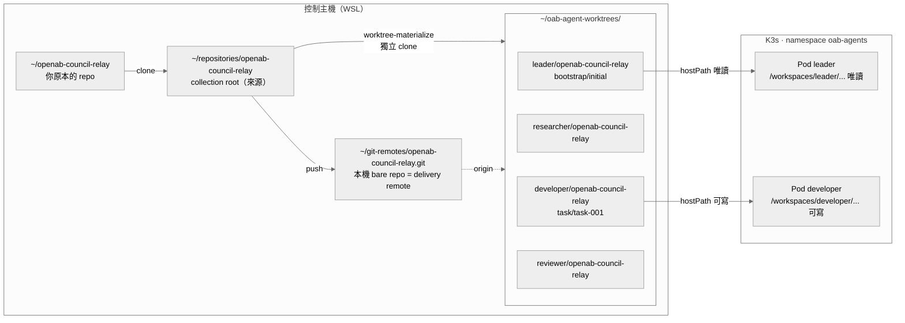

# 本機部署實作

這份文件記錄**這台機器上的實際配置**，與 [操作手冊.md](操作手冊.md)（通用流程）不同：
所有路徑、值、指令都是可以直接複製執行的真實內容。

最後更新：2026-09-04

---

## 目前進度

| 階段 | 狀態 |
| --- | --- |
| 來源 repo 與 collection root | ✅ 已建立 |
| 四個 agent 的 workspace（獨立 clone） | ✅ 已 materialize |
| catalog、環境合約、remotes、備份來源 | ✅ 已建立並驗證通過 |
| 本機 delivery remote（取代 GitLab） | ✅ 已建立 |
| Helm values／K8s manifest 渲染 | ✅ 已驗證 |
| Container image 相容性 | ✅ 已驗證（UID 1000、`/home/agent`、`openab-agent` 存在） |
| K3s bootstrap（namespace／RBAC／兩份憑證） | ✅ 已完成，6 項權限邊界實測通過 |
| K3s state 匯出 | ✅ 已建立（見下方說明） |
| 外部備份 | ✅ 已驗證（2711 檔案、含 SHA-256） |
| Preflight | ✅ `ready: true` |
| 部署到 K3s | ✅ `applied: true`，4 Deployment／4 PVC／4 ConfigMap／4 Secret |
| **Agent 讀取 workspace** | ✅ **已實測驗證（見下方）** |

### 實測結果（2026-09-04 03:17）

四個 agent Pod 全部 `Running 1/1`，OpenAB harness 正常執行：

```
tini -- openab run -c /etc/openab/config.toml
openab run -c /etc/openab/config.toml
```

harness 載入的設定與 catalog 宣告完全一致：

```
config loaded agent_cmd=openab-agent pool_max=10 discord=true
starting discord adapter allow_all_channels=false allow_all_users=false
  channels=1 users=0 trusted_bots=1
  allow_bot_messages=Mentions allow_user_messages=MultibotMentions allow_dm=false
```

| 驗證項目 | 結果 |
| --- | --- |
| developer 容器內讀取 workspace | ✅ 11 個檔案，屬主 `agent`(UID 1000) |
| 是真實 git checkout | ✅ 分支 `task/task-001`，origin 指向 delivery remote，commit 歷史完整 |
| developer 寫入（`write` grant） | ✅ 成功 |
| reviewer 寫入（`read` grant） | ✅ 被拒：`Read-only file system` |
| reviewer 讀取 | ✅ 正常 |
| 掛載旗標（容器內 `mount`） | ✅ developer `rw`／leader・researcher・reviewer `ro` |
| Discord bot 連線 | leader ✅／researcher ✅／developer ✅／reviewer ❌ |
| Helm release 儲存位置 | ✅ `configmap/sh.helm.release.v1.oab-agents.v1`（非 Secret） |

> reviewer 的 bot 啟動正常但未連上 Discord，其他三個都成功 ——
> 應是 `config/secrets.yaml` 內 reviewer 的 token 失效，需要重新產生。

控制平面觀測：

```
workspace-{leader,researcher,developer,reviewer}: state=clean
task-001: state=on-track catalog_binding=aligned
runtime: healthy （4 個 pod 全部 Running／ready／restarts=0）
```

---

## 環境拓撲



---

## 已建立的檔案

| 檔案 | 用途 |
| --- | --- |
| `config/catalog.yaml` | 四個 agent 的完整宣告 |
| `config/environment.yaml` | 環境合約，狀態已為 `ready` |
| `config/reference-manifest.yaml` | Secret／identity 參照名稱 |
| `config/remotes.json` | repository → delivery remote 對應 |
| `config/backup-sources.json` | 備份四元件路徑 |
| `config/tasks/task-001.json` | developer 的第一個任務定義 |
| `scripts/bootstrap-k3s.sh` | K3s 一次性 bootstrap |
| `.oab-control/` | 執行期狀態（任務紀錄、registry），已加入 `.gitignore` |

主機上另外建立了：

```
~/repositories/openab-council-relay          collection root 內的來源 repo
~/git-remotes/openab-council-relay.git       本機 bare repo，模擬 GitLab delivery remote
~/oab-agent-worktrees/{leader,researcher,developer,reviewer}/openab-council-relay
~/oab-agent-backups/                         備份目標
```

---

## 步驟 1：K3s bootstrap（需要 sudo，只做一次）

`/etc/rancher/k3s/k3s.yaml` 是 root-only，所以這一步必須由你執行：

```bash
cd ~/oab-agents-control
bash scripts/bootstrap-k3s.sh
```

腳本會（可重複執行）：

1. 用 sudo 把 admin kubeconfig 複製到 `~/.kube/oab-admin.kubeconfig`（0600）
2. 套用 namespace `oab-agents`、6 個 ServiceAccount、RBAC、default-deny NetworkPolicy
3. 建立兩個 ServiceAccount 的長期 token
4. 產生兩份 namespace-scoped kubeconfig
5. **實測驗證權限邊界**（deployer 不能讀 Secret、materializer 不能部署）

若第 5 步任何一項不符預期，腳本會直接失敗並告訴你哪一項。

---

## 步驟 2：設定兩個 kubeconfig 環境變數

```bash
export KUBECONFIG="$HOME/.kube/oab-control-deployer.kubeconfig"
export OAB_SECRET_MATERIALIZER_KUBECONFIG="$HOME/.kube/oab-control-secret-materializer.kubeconfig"
```

要永久生效就加進 `~/.bashrc`。

這兩份憑證的權限分界說明見
[部署前置資料清單.md](部署前置資料清單.md#k3s-bootstrap-的權限分界)。

---

## 步驟 3：Preflight（唯讀）

```bash
cd ~/oab-agents-control
PYTHONPATH=. python3 -m oab_control.cli preflight config/environment.yaml \
  --chart ~/openab/charts/openab --json
```

必須看到 `"ready": true` 才繼續。它會檢查合約、`git`／`helm`／`kubectl`、
chart 的 `Chart.yaml`，以及兩個 kubeconfig 指向不同且存在的檔案。

---

## 步驟 4：匯出 K3s state 並執行外部備份

### 為什麼 `k3s_state` 不能直接指向 `/var/lib/rancher/k3s`

實測發現這條路徑**在設計上就不可能通過備份**：

1. 整個目錄樹是 root-only，一般操作員讀不到（`data/.lock` 會直接 Permission denied）
2. 更根本的是 `server/tls/` 底下有 **17 個 PEM 私鑰**，而 `LocalBackup.verify()`
   會主動拒絕任何含私鑰的備份 —— 就算用 root 跑也會被自己的檢查擋下

對這個控制平面而言，真正需要還原的 K3s 狀態是 **agent 的 PVC 資料**
（local-path-provisioner 放在 `/var/lib/rancher/k3s/storage`），它不含任何憑證。
K3s 伺服器本身的憑證與 datastore 屬於叢集層級備份，應由 k3s 自己的
etcd-snapshot 或磁碟層級加密備份處理。

因此環境合約的 `paths.k3s_state` 指向 `~/oab-k3s-state`，由這個腳本維護：

```bash
bash scripts/export-k3s-state.sh
```

腳本用 docker（容器內是 root，你在 docker 群組所以不需 sudo）把 PVC 資料複製出來、
改成你的所有權，並檢查匯出內容不含 `.key`／`.pem`。
**每次備份或部署前都應該重跑一次**，讓匯出保持最新。

### 執行備份

```bash
PYTHONPATH=. python3 -m oab_control.cli backup config/backup-sources.json \
  --output ~/oab-agent-backups \
  --attestation "local bootstrap disk verified by operator" \
  --yes --json
```

> ⚠️ `~/oab-agent-backups` 目前只是一般本機目錄，**不是加密外部儲存**。
> attestation 是你對「這個位置已加密」的聲明，工具無法自行驗證。
> 正式使用時請改指向真正的加密外接磁碟或 NAS。

備份會排除 `secrets.yaml` 等密鑰檔名，並記錄每個檔案的 SHA-256。

---

## 步驟 5：部署

先不帶 `--yes` 預覽（不會變更叢集）：

```bash
PYTHONPATH=. python3 -m oab_control.cli deploy config/catalog.yaml \
  --snapshot-dir .oab-control/snapshots --json | head -40
```

確認 plan 無誤後正式部署：

```bash
PYTHONPATH=. python3 -m oab_control.cli deploy config/catalog.yaml \
  --environment config/environment.yaml \
  --chart ~/openab/charts/openab \
  --secrets-file config/secrets.yaml \
  --backup-sources config/backup-sources.json \
  --backup-output ~/oab-agent-backups \
  --backup-attestation "local encrypted disk verified by operator" \
  --snapshot-dir .oab-control/snapshots \
  --yes --json
```

執行順序：驗證 → 路徑對齊 → worktree 檢查 → **備份** → snapshot →
`kubectl apply` 隔離資源 → Secret 物料化 → `helm upgrade --install`。
備份失敗會直接中止，不會呼叫 K3s。

---

## 步驟 6：驗證 agent 真的讀到 workspace

這是這份文件的重點 —— 確認 workspace 掛載真的生效。

### 哪些指令用哪個身分

| 動作 | 身分 | 原因 |
| --- | --- | --- |
| `get pods`、`oab-control status` | **deployer**（步驟 2 設定的） | 有唯讀的 pods 權限 |
| `exec`、`logs` | **bootstrap**（`~/.kube/oab-admin.kubeconfig`） | 見下方 |

> ⚠️ **deployer 不能、也不應該能 `exec` 進 Pod。**
>
> Agent 容器透過 `secretKeyRef` 取得 `DISCORD_BOT_TOKEN` 環境變數。
> 只要能 `exec` 進容器就能 `echo $DISCORD_BOT_TOKEN` 把 Secret 值讀出來，
> 那條「deployer 不可讀取 Secret」的邊界就完全失效了。`pods/log` 同理。
>
> 所以下面的 `exec` 指令刻意改用 bootstrap 憑證。
> 若你看到 `cannot create resource "pods/exec"`，那是**設計正確**的表現，
> 不是要放寬權限的訊號。

### 唯讀觀測（deployer 身分）

```bash
kubectl -n oab-agents get pods

PYTHONPATH=. python3 -m oab_control.cli status config/catalog.yaml \
  --environment config/environment.yaml \
  --registry-json .oab-control/workspace-registry.json \
  --tasks-dir .oab-control/tasks --json
```

`status` 的 `runtime.state` 應為 `healthy`，並列出四個 Pod。

### 掛載驗證（bootstrap 身分）

```bash
# 這一段改用 bootstrap 憑證，不要動到步驟 2 設定的 KUBECONFIG
ADMIN=~/.kube/oab-admin.kubeconfig

# 1. 在 developer 容器內列出被掛載的 workspace
KUBECONFIG=$ADMIN kubectl -n oab-agents exec deploy/developer -- \
  ls -la /workspaces/developer/openab-council-relay

# 2. 確認是完整 git checkout，且在正確的 task 分支上
KUBECONFIG=$ADMIN kubectl -n oab-agents exec deploy/developer -- sh -c \
  'cd /workspaces/developer/openab-council-relay && git config --global --add safe.directory "*"; \
   echo "分支: $(git branch --show-current)"; git log --oneline -3'

# 3. 唯讀 grant 必須擋住寫入（預期失敗）
KUBECONFIG=$ADMIN kubectl -n oab-agents exec deploy/reviewer -- \
  sh -c 'touch /workspaces/reviewer/openab-council-relay/SHOULD_FAIL' \
  && echo "❌ 唯讀掛載失效" || echo "✅ 唯讀掛載生效"

# 4. developer 必須可寫
KUBECONFIG=$ADMIN kubectl -n oab-agents exec deploy/developer -- sh -c \
  'touch /workspaces/developer/openab-council-relay/.write-test \
   && rm /workspaces/developer/openab-council-relay/.write-test && echo ok' \
  && echo "✅ developer 可寫"

# 5. 掛載旗標（ro/rw）逐一確認
for a in leader researcher developer reviewer; do
  printf "  %-11s " "$a"
  KUBECONFIG=$ADMIN kubectl -n oab-agents exec deploy/$a -- \
    sh -c "mount | grep workspaces | grep -o '(r[wo],' | head -1"
done
```

預期第 5 項輸出：`developer` 是 `rw`，其餘三個是 `ro`。

---

## 日常操作：派一個新任務

```bash
# 1. 複製任務範本並修改
cp config/tasks/task-001.json config/tasks/task-002.json
#    改 task_id、goal、scope、branch（branch 要是 task/task-002）

# 2. 建立並派工
PYTHONPATH=. python3 -m oab_control.cli task-create config/tasks/task-002.json \
  --catalog config/catalog.yaml --secrets-file config/reference-manifest.yaml \
  --tasks-dir .oab-control/tasks --json

PYTHONPATH=. python3 -m oab_control.cli task-transition task-002 assigned \
  --tasks-dir .oab-control/tasks --json

# 3. 切換 workspace 到新的 task 分支
PYTHONPATH=. python3 -m oab_control.cli worktree-materialize \
  config/catalog.yaml developer task-002 \
  --remotes-file config/remotes.json --allow-local-remotes \
  --secrets-file config/reference-manifest.yaml \
  --registry-json .oab-control/workspace-registry.json \
  --tasks-dir .oab-control/tasks --json
```

> 全域同時最多 **2 個**未結束任務，每個 agent 最多 1 個。
> 完整生命週期與驗收閘門見 [操作手冊.md](操作手冊.md#任務與-worktree-生命週期)。

---

## 目前的已知限制

這些都不影響「workspace 掛載」，但影響 agent 能否真正產出工作成果：

| 項目 | 現況 | 要讓它運作需要做什麼 |
| --- | --- | --- |
| **Discord ID** | 佔位值（`9000...` 開頭） | 在 `config/catalog.yaml` 用 `grep 9000` 找出全部並換成真實 snowflake |
| **Discord bot token** | `config/secrets.yaml` 內可能仍是範本值 | 從 Discord 開發者後台取得四個 bot 的 token 填入 |
| **LLM 憑證** | 未設定 | `-native` 變體需要模型供應商的 API key；目前 catalog 的 `model` 是 `model-*` 佔位字串 |
| **delivery remote** | 本機 bare repo（`file://`） | 有真正的 GitLab 後，改 `config/remotes.json` 為 https/ssh URL，並移除 `--allow-local-remotes` |
| **備份目標** | 一般本機目錄 | 改指向真正的加密外接儲存 |
| **Image 變體** | `-native`（home 是 `/home/agent`） | 見下方 |

### 改用其他 image 變體（claude／gemini／opencode）

目前四個 agent 都用 `-native`。要換成別的 ACP CLI，在該 agent 的 `runtime`
同時改三個欄位 —— `image`、`command`、`working_dir`：

```yaml
developer:
  runtime:
    command: claude                                          # 該變體的 ACP CLI
    args: []
    model: claude-sonnet-4-5
    image: ghcr.io/openabdev/openab:0.9.0-beta.9-claude
    working_dir: /home/node                                  # 該變體以 node 身分執行
```

`working_dir` 是逐 agent 設定，所以可以只換 developer、其餘維持 `-native`。
變體對照表與確認 home 的方法見
[參考/catalog-契約.md](參考/catalog-契約.md#working_dir-與-image-變體)。

> ⚠️ 換變體後 agent 需要對應的 LLM 憑證才能真正運作
> （`-claude` 需要 Anthropic 認證，`-gemini` 需要 Google 認證）。
> 掛載與啟動不受影響，但 agent 不會有推理能力。

### Discord／GitLab adapter 尚未存在

即使上述全部補齊，**agent 之間仍不會自動協作**：Discord 派工 adapter（A007）
與 GitLab MR／CI evidence adapter（A009）不在本 repository 範圍內。
目前任務狀態的推進全靠 leader 用 CLI 手動轉錄。
見 [根目錄 README](../README.md#目前邊界)。

---

## 疑難排解

| 症狀 | 原因與處理 |
| --- | --- |
| `preflight` 回報 `kubeconfigs.distinct_paths: false` | 兩個環境變數指向同一個檔案，或其中一個沒設定 |
| `deploy --yes` 報 `environment contract is not ready` | `config/environment.yaml` 的 `status` 不是 `ready`，或 `pending_decisions` 非空 |
| `deploy --yes` 報 `agent worktree is not materialized` | 某個 agent 的 checkout 不存在，重跑 `worktree-materialize` |
| Pod `ImagePullBackOff` | image tag 不存在；用 `docker manifest inspect <image>` 確認 |
| Pod `CreateContainerConfigError` | Secret 未物料化；確認 `--secrets-file config/secrets.yaml` 有帶到 |
| Pod 起不來且 hostPath 報錯 | 主機路徑不存在；`type: Directory` 要求目錄必須先存在 |
| `helm upgrade` 報 `secrets is forbidden` | 不應再發生（已改用 ConfigMap release driver）；若出現請確認用的是 deployer kubeconfig |
| `worktree-materialize` 報 `must not be a local path` | 用了 `file://` remote 但沒加 `--allow-local-remotes` |

---

## 相關文件

- [操作手冊.md](操作手冊.md) — 通用流程與所有閘門的完整說明
- [架構說明.md](架構說明.md) — 為什麼要兩份 kubeconfig、為什麼備份在 snapshot 之前
- [部署前置資料清單.md](部署前置資料清單.md) — 權限分界
- [參考/catalog-契約.md](參考/catalog-契約.md) — catalog 欄位規則
